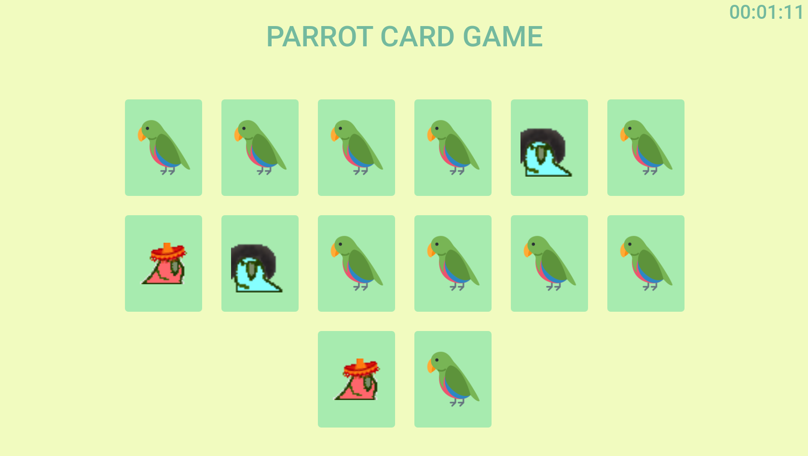

# Sobre
O parrots card game nada mais é que um jogo da memória! Foi construído com as tecnologias puras da web: JavaScript, HTML e CSS. Nenhuma biblioteca ou framework foi usado. Ficou curioso e quer dar uma olhada? É só [acessar aqui](https://yoyolops.github.io/parrotsCardGame/)

# Como funciona?
Primeiro, você precisa escolher com quantas cartas quer jogar, um número entre 4 e 14. Ao clicar em uma carta, ela será virada e assim permanecerá até que outra seja selecionada. Quando a segunda carta for selecionada, é verificado se são correspondentes. Caso sejam, ambas permanecem viradas até o fim do jogo, caso contrário elas desviram e o jogo continua.

# Print

